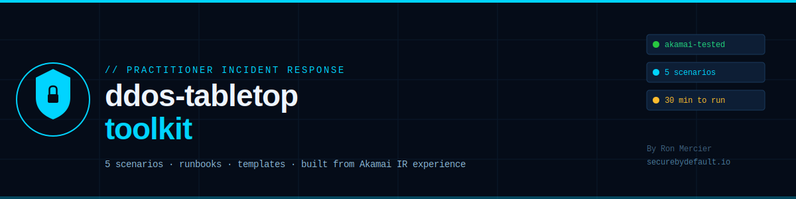

# ddos-tabletop-toolkit

**A practitioner's toolkit for running DDoS incident response tabletop exercises.**

Built from real operational experience doing DDoS mitigation and incident response at Akamai Technologies — one of the companies whose entire job is absorbing attacks so other companies' infrastructure stays online. This isn't theoretical. These scenarios, decision points, and runbooks reflect what actually happens when a real DDoS hits a real system.

> 📖 **Read the practitioner's guide behind this toolkit:**
> [How to Protect Your Cloud Server From DDoS Attacks](https://securebydefault.io)
>
> 🌐 **More security resources:** [securebydefault.io](https://securebydefault.io)

---



---

## Why This Exists

The single biggest difference between teams that survive a DDoS and teams that don't has almost nothing to do with technology.

It's whether they've practiced.

The teams that survive have already answered the hard questions on a calm Tuesday: Who declares the incident? What do we reach for first? Who has credentials to the CDN dashboard? How do we communicate with customers while it's happening? What does "this is a smokescreen" look like, and what do we do about it?

The teams that don't survive find out the answers during the actual attack — which is exactly the wrong time to discover your runbook has gaps, nobody knows the on-call rotation, and the person with CDN admin access is on vacation.

This toolkit exists so your first DDoS isn't also your first practice.

---

## What's in the Toolkit

```
ddos-tabletop-toolkit/
├── README.md                          ← You are here
├── scenarios/
│   ├── 01-volumetric-flood.md         ← Classic bandwidth saturation attack
│   ├── 02-layer7-application.md       ← Sophisticated L7 attack on app endpoints
│   ├── 03-smokescreen-attack.md       ← DDoS as cover for data exfiltration
│   ├── 04-economic-dos.md             ← Cloud bill attack via auto-scaling abuse
│   └── 05-multi-vector.md             ← Combined volumetric + L7 escalation
├── runbooks/
│   ├── INCIDENT-RESPONSE.md           ← Step-by-step IR runbook
│   ├── ESCALATION-CONTACTS.md         ← Template for on-call and vendor contacts
│   └── COMMUNICATION-TEMPLATES.md     ← Customer/stakeholder comms during attack
├── templates/
│   ├── EXERCISE-FACILITATOR.md        ← How to run a tabletop (for the facilitator)
│   ├── EXERCISE-SCORECARD.md          ← Track team decisions and gaps found
│   └── POST-EXERCISE-REPORT.md        ← Template for after-action documentation
└── docs/
    ├── banner.png
    ├── diagram.png
    ├── ATTACK-TYPES.md                ← Reference: the 3 DDoS categories explained
    └── MITIGATION-LAYERS.md           ← Reference: defense-in-depth architecture
```

---

## Quick Start: Run Your First Tabletop in 30 Minutes

You don't need a full day or a dedicated facilitator. A 30-minute tabletop exercise catches the most critical gaps and costs almost nothing.

### 1. Pick a scenario (5 min)

Choose based on your biggest risk:
- New to this? Start with **[Scenario 01 — Volumetric Flood](scenarios/01-volumetric-flood.md)**
- Have CDN in place? Go harder with **[Scenario 02 — Layer 7](scenarios/02-layer7-application.md)**
- Most concerned about data theft? Run **[Scenario 03 — Smokescreen](scenarios/03-smokescreen-attack.md)**
- Cloud/AWS/GCP? **[Scenario 04 — Economic DoS](scenarios/04-economic-dos.md)** is the one that keeps cloud engineers up at night

### 2. Gather the right people (5 min)

A tabletop needs at minimum:
- **1 facilitator** (reads the scenario, asks inject questions)
- **1-2 decision makers** (who would actually handle this in real life)
- Ideal size: 3-6 people. More than 8 becomes unwieldy.

### 3. Set ground rules (2 min)

Tell the group:
- This is a safe space — there are no wrong answers, only gaps to find
- "I don't know" is a valid and valuable answer — write it down
- The goal is to find problems, not prove everything works

### 4. Run the scenario (15 min)

The facilitator reads the scenario aloud, pausing at each **INJECT** point to ask: *"What do you do?"*

Document every decision, every hesitation, every "I don't know who handles that."

### 5. Debrief (8 min)

Three questions only:
1. What went well?
2. Where did we get stuck?
3. What are the top 3 action items?

Fill out **[Exercise Scorecard](templates/EXERCISE-SCORECARD.md)** and assign owners to every action item before leaving the room.

---

## The 5 Scenarios

| # | Scenario | Difficulty | Duration | Best For |
|---|---|---|---|---|
| 01 | Volumetric Flood | Beginner | 20 min | First tabletop, any team |
| 02 | Layer 7 Application Attack | Intermediate | 30 min | Teams with CDN in place |
| 03 | Smokescreen + Data Exfil | Advanced | 45 min | Security-focused teams |
| 04 | Economic DoS (Cloud Bill) | Intermediate | 25 min | Cloud-hosted infrastructure |
| 05 | Multi-Vector Escalation | Advanced | 60 min | Experienced IR teams |

---

## What You'll Find in Your Gaps

After running hundreds of incident scenarios, these are the gaps that come up most reliably. Don't be embarrassed — everyone finds them:

**People gaps (most common)**
- Nobody knows who declares an incident officially
- The person with CDN/scrubbing dashboard access is unavailable
- Customer communication ownership is unclear — engineering assumes marketing handles it, marketing assumes engineering does

**Process gaps**
- No documented escalation path — decisions happen ad hoc
- "Under attack mode" on the CDN has never been tested and nobody knows where the toggle is
- The incident response plan exists but is stored somewhere inaccessible when the site is down

**Technical gaps**
- Origin IP is discoverable by attackers (bypasses CDN protection entirely)
- No billing alerts set — an economic DoS could run for hours before discovery
- Rate limiting exists in theory but the specific thresholds haven't been reviewed in years

---

## Adapting the Scenarios

Every scenario in this toolkit is written generically so it can apply to your actual environment. Before running, spend 5 minutes customizing:

- Replace "the company's website" with your actual domain
- Replace "the CDN dashboard" with your actual vendor (Cloudflare, AWS CloudFront, etc.)
- Replace "the on-call engineer" with your actual person's name and contact
- Add any environment-specific constraints (compliance requirements, SLA commitments, etc.)

Customization takes the exercise from "abstract hypothetical" to "uncomfortably realistic" — which is exactly the goal.

---

## Related Resources

- [securebydefault-server-hardening](https://github.com/RonMercier/securebydefault-server-hardening) — Nginx, UFW, Fail2Ban, SSH configs for cloud VPS
- [cloud-security-checklist](https://github.com/RonMercier/cloud-security-checklist) — 28-item security baseline checklist
- [SecureByDefault.io](https://securebydefault.io) — Real attack breakdowns and practitioner guides
- [The SecureByDefault Brief](https://newsletter.securebydefault.io) — Weekly security newsletter

---

## Contributing

Open issues or PRs for:
- New scenario types (amplification attacks, IoT botnet scenarios, DNS-based attacks)
- Runbook improvements based on real incidents
- Additional communication templates
- Translations

Every contribution should be grounded in realistic, practitioner-tested scenarios — not theoretical attacks from a textbook.

---

## License

MIT License — use freely for internal exercises, training, conferences, or courses.
Attribution to this repo is appreciated but not required.

---

## About

Built by **Ron Mercier** — Cloud & Cybersecurity Engineer.
Previously: DDoS mitigation and incident response at **Akamai Technologies**.
MSc Cybersecurity · CySA+ · PenTest+ · ISC2 CC · AWS CCP.

[securebydefault.io](https://securebydefault.io) · [Newsletter](https://newsletter.securebydefault.io) · [LinkedIn](https://www.linkedin.com/in/ron-mercier)

---

*"Your first DDoS shouldn't also be your first practice."*
